# Code Notes - Architecture Documentation

## Overview

Code Notes is a cross-platform note-taking application for code questions and quizzes. It supports web browsers and Tauri desktop (including Android), and can be embedded into `glean-oak-app` via Shadow DOM. Built as a Turborepo monorepo with offline-first IndexedDB storage and checkpoint-based sync.

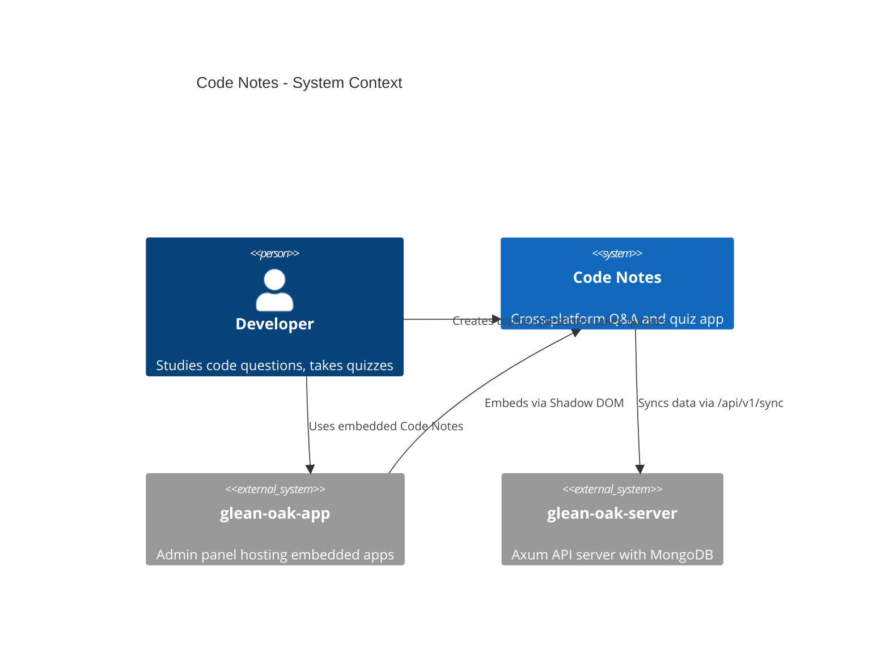

## Monorepo Structure

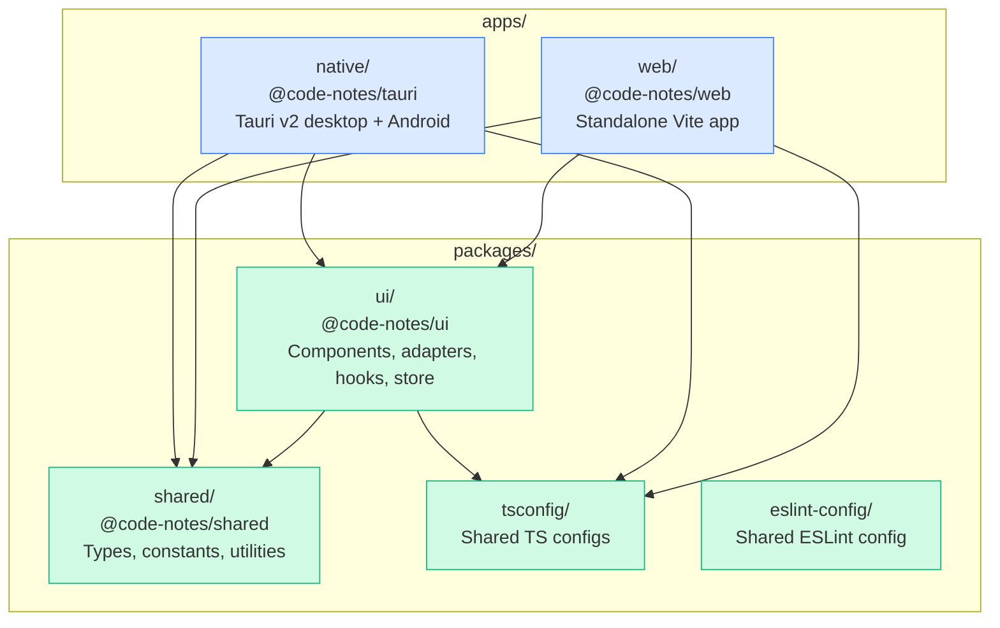

## Service Architecture

The app uses a **Service Locator** pattern. Services are registered via setter functions at startup and retrieved via getters throughout the app.

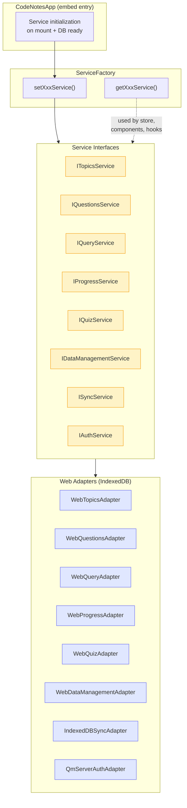

### Service Registration Flow

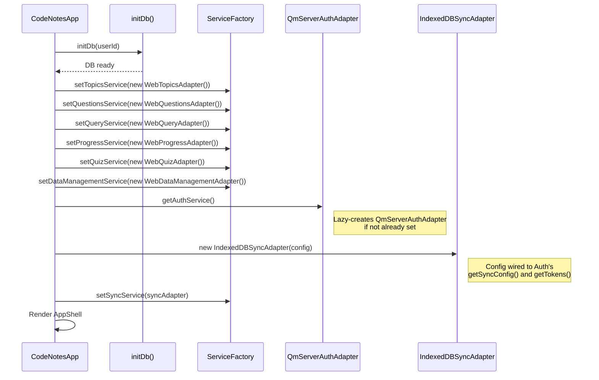

## Data Model

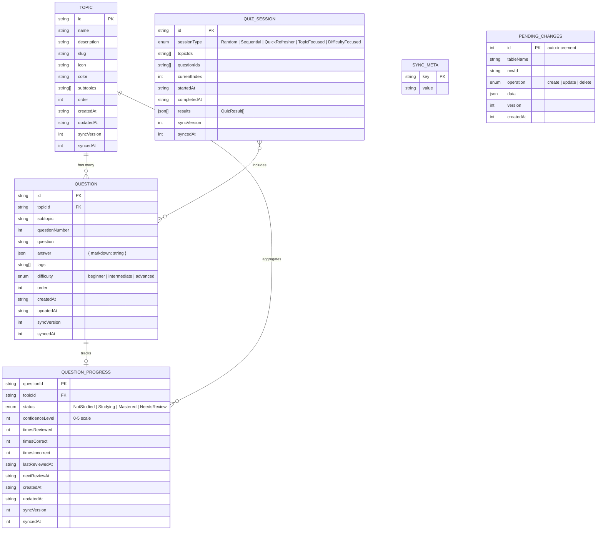

## State Management

Zustand store with slices, persisted to localStorage. IndexedDB is the source of truth for data; the store caches it for reactive UI updates.

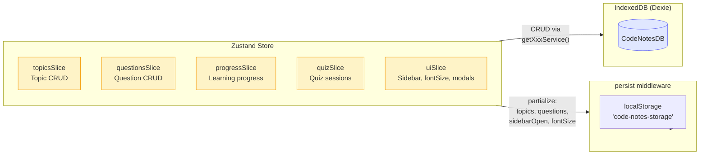

**Persisted fields:** `topics`, `questions`, `sidebarOpen`, `fontSize`

**Not persisted (fetched fresh):** `progressMap` (Map object), `activeSession` (ephemeral quiz state)

## Sync Architecture

Offline-first with checkpoint-based delta sync against `glean-oak-server`.

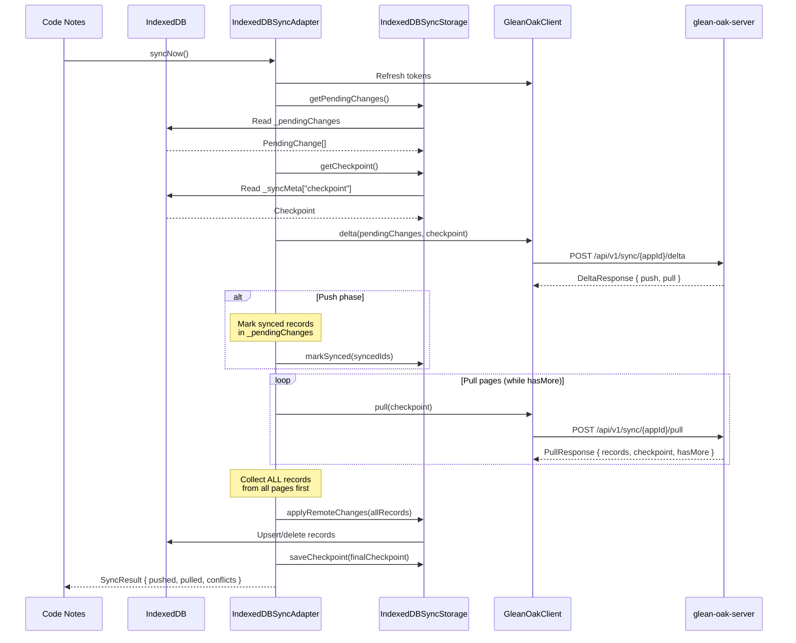

### Auth Flow (Dual Auth)

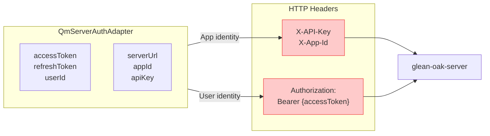

## Embedding in glean-oak-app

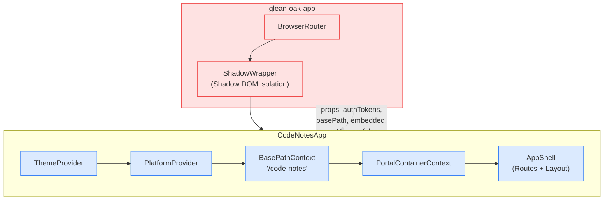

**Key embedding behaviors:**
- `useRouter=false` — shares parent's `BrowserRouter`
- `embedded=true` — ThemeProvider dispatches custom events instead of modifying `document.documentElement`
- Auth tokens passed as props (SSO via shared localStorage)
- Logout cleanup syncs pending changes before deleting user's IndexedDB

## Platform Differences

Both Tauri and Web use IndexedDB for all data. The only difference is platform services.

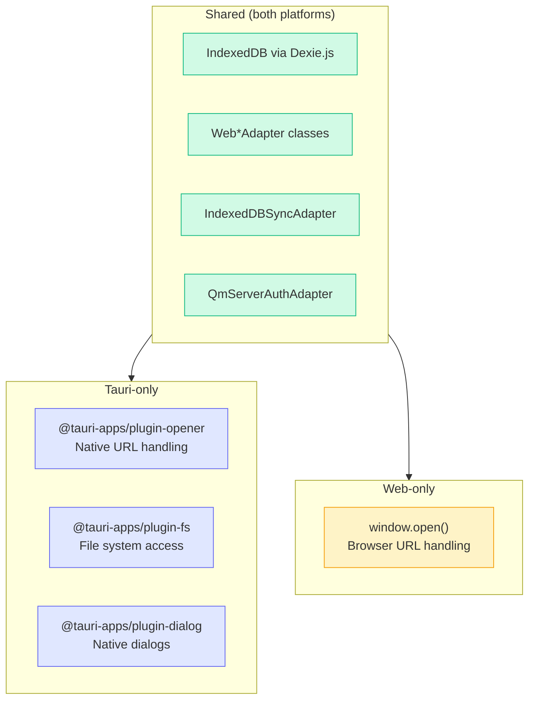

## Component Architecture (Atomic Design)

```mermaid
flowchart TB
    subgraph Templates
        AppShell["AppShell<br/>Layout + routing"]
        AppLayout["AppLayout"]
    end

    subgraph Pages
        Topics["TopicsPage"]
        Questions["QuestionsPage"]
        QuestionDetail["QuestionDetailPage"]
        Progress["ProgressDashboardPage"]
        QuizMode["QuizModePage"]
        QuizSession["QuizSessionPage"]
        QuizResults["QuizResultsPage"]
        Search["SearchPage"]
        Settings["SettingsPage"]
        Import["ImportPage"]
        DataMgmt["DataManagementPage"]
        Login["LoginPage"]
    end

    subgraph Organisms
        Sidebar["Sidebar"]
        BottomNav["BottomNavigation"]
        TopicForm["TopicForm"]
        QuestionForm["QuestionForm"]
        ImportForm["ImportForm"]
        SyncSettings["SyncSettings"]
    end

    subgraph Molecules
        MarkdownRenderer["MarkdownRenderer"]
        ConfidenceRating["ConfidenceRating"]
        ProgressBadge["ProgressBadge"]
        Modal["Modal"]
    end

    subgraph Atoms
        Button["Button"]
        Input["Input"]
        Card["Card"]
        Badge["Badge"]
        Dialog["Dialog"]
        Select["Select"]
        Label["Label"]
        Textarea["Textarea"]
        LoadingSpinner["LoadingSpinner"]
        ErrorBoundary["ErrorBoundary"]
        ThemeToggle["ThemeToggle"]
    end

    Templates --> Pages
    Pages --> Organisms
    Organisms --> Molecules
    Molecules --> Atoms

    classDef tmpl fill:#fecaca,stroke:#ef4444
    classDef page fill:#fed7aa,stroke:#f97316
    classDef org fill:#fef08a,stroke:#eab308
    classDef mol fill:#bbf7d0,stroke:#22c55e
    classDef atom fill:#bfdbfe,stroke:#3b82f6

    class AppShell,AppLayout tmpl
    class Topics,Questions,QuestionDetail,Progress,QuizMode,QuizSession,QuizResults,Search,Settings,Import,DataMgmt,Login page
    class Sidebar,BottomNav,TopicForm,QuestionForm,ImportForm,SyncSettings org
    class MarkdownRenderer,ConfidenceRating,ProgressBadge,Modal mol
    class Button,Input,Card,Badge,Dialog,Select,Label,Textarea,LoadingSpinner,ErrorBoundary,ThemeToggle atom
```

## Routing

All routes are defined in `AppShell.tsx` with lazy-loaded pages.

| Route | Page | Description |
|-------|------|-------------|
| `/` | TopicsPage | Topic list (home) |
| `/topics/:topicId` | QuestionsPage | Questions for a topic |
| `/questions/:questionId` | QuestionDetailPage | Single question view |
| `/quiz` | QuizModePage | Quiz mode selection |
| `/quiz/:sessionId` | QuizSessionPage | Active quiz |
| `/quiz/results/:sessionId` | QuizResultsPage | Quiz results |
| `/progress` | ProgressDashboardPage | Learning progress |
| `/search` | SearchPage | BM25 global search with filters |
| `/import` | ImportPage | Data import |
| `/data-management` | DataManagementPage | Export/clear data |
| `/settings` | SettingsPage | App settings |
| `/login` | LoginPage | Auth (skippable) |

When embedded, routes are prefixed with `basePath` (e.g., `/code-notes/quiz`).

## Quiz Flow

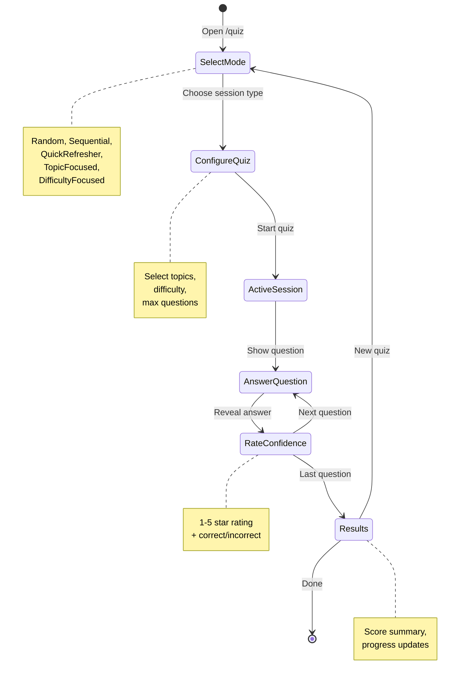

## Per-User Database Isolation

Each authenticated user gets their own IndexedDB instance, named with a SHA-256 hash prefix of the user ID.

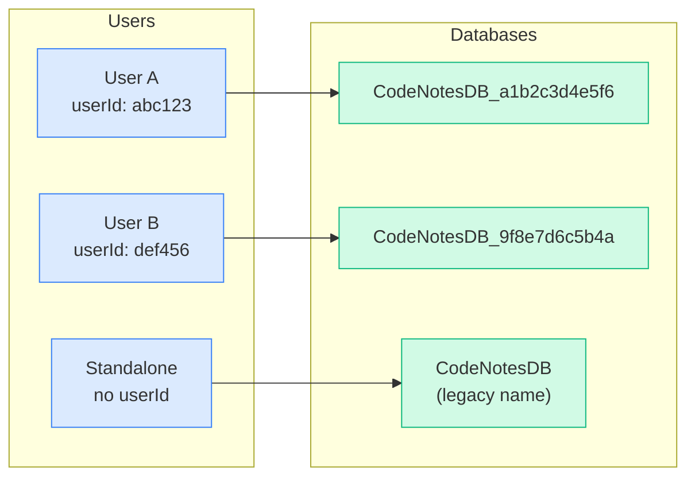

On logout, pending changes are synced first, then the user's database is deleted via `Dexie.delete()`.
